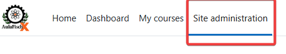

# Guía para administradores

## CREACIÓN DE CURSO {.text-center}

  <iframe
    width="560" height="315"
    src="https://www.youtube.com/embed/VNV6FwhHZRA"
    title="YouTube video player"
    frameborder="0"
    allow="accelerometer; autoplay; clipboard-write; encrypted-media; gyroscope; picture-in-picture"
    allowfullscreen>
  </iframe>

  
    😵‍💫 Si el vídeo no fue suficiente y tienes dudas, aquí algunos detalles extra:
  

1️⃣ **Paso 1:** Primero ingresa a **“Site administration”**  

  

2️⃣ Paso 2: En el menú lateral, ve a **“Courses”** y selecciona **“Add a new course”**

  

3️⃣ Paso 3: Rellena el Nombre completo del curso y el Nombre corto,  Elige la Categoría donde se ubicará el curso, Ajusta la Fecha de inicio y, si lo deseas, la Fecha de finalización.

  

4️⃣ Paso 4: Haz clic en **“Save and display”** y, luego, verifica que tu nuevo curso aparezca en la lista de cursos.

  

  

  ⚠️ ¡¡¡Espera un error!!!

  

  

  

## CREACIÓN DE USUARIOS {.text-center}

  
    😵‍💫 Si el vídeo no fue suficiente y tienes dudas, aquí algunos detalles extra:
  

  

Cómo crear, editar y eliminar cuentas de usuarios, y asignar roles.

## Seguridad y respaldo
Configuración de medidas de seguridad, respaldos automáticos y recuperación ante fallos.

## Personalización
Modificar el aspecto de la plataforma, cambiar logotipos, colores y bloques del dashboard.
